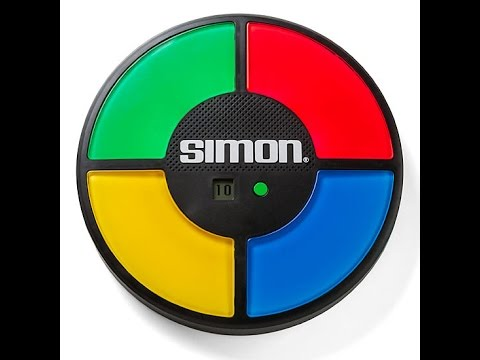

# Simon Game

This is web application modeled after the physical children's toy: Simon. The concept of the toy is that, when activated, it would it would play a combination of sounds and colours that the user would have to mimic. Each iteration of the game would increase by one colour/sound. 

The current version can be viewed on GitHub Pages at: 
https://elisery.github.io/simongame/

## Tech Stack

- HTML5
- CSS
- jQuery

## Developer

This application was designed and coded by Elise Yohm

## Next Steps

I am in the process of converting this app to ReactJS

